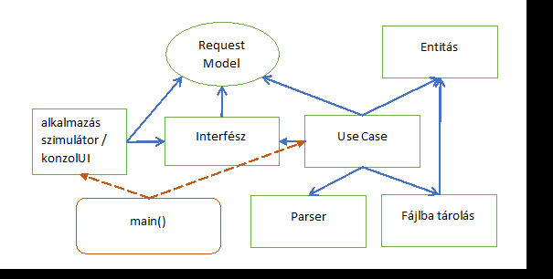

# Minta példa - POJO LOGGER

### Cél
POJO alkalmazás készítése mely bemutat egy boundery típusú interfész használatot.



### Feladat

Készítsünk egy alkalmazást, amely segít kényelmesen logolni. 
Tehát, nem kell mindent infót minden sorban elküldeni,
hanem előre beállítható 
például: logolási szint, folyamat azonosító, output file.
A dátumot automatikusan illeszti a log bejegyzéshez.

**Az interfész JSON objektumot vár!**

----

#### Output példa

`log.txt >> Warning|2023-01-02 13:00:12 (Z)|123456|a fájl nem található`

**[szint]|[dátum és idő]|[folyamat azonosító]|[szabad szöveg]**

#### Interface terv
```
setOutputFile(Json json) -> [filename] 
setLogLevel(Json json) -> [szint]
addLog(Json json) -> [folyamat azonosító]|[szabad szöveg])

command (F,L,A) (file, level, logsor)
command függően 1 vagy 2 paramétert kér be
```
